# ODT (Operational Digital Twin) — Execution Flow Analysis

> **Legend**
> - 🖥️ `[GUI]` — Screens the user sees and interacts with
> - ⚙️ `[Logic]` — Internal code running behind the scenes (Store, Service, API modules, etc.)
> - 🌐 `[Backend]` — External servers / simulators

## Table of Contents
1. [End-to-End Execution Overview](#1-overview)
2. [Phase 1: Login → Home → Service Bootstrap](#2-phase-1)
3. [Phase 2: Initial Configuration](#3-phase-2)
4. [Phase 3: Mission Execution (Simple Mode)](#4-phase-3)
5. [Phase 4: Operation Environment (Visualization)](#5-phase-4)
6. [Phase 5: Vertiport Customize](#6-phase-5)
7. [State Machine & Guard System](#7-state-machine)
8. [Real-time Data Polling](#8-polling)
9. [Runtime Architecture — How Tabs Run in Parallel](#9-parallel)

---

## 1. End-to-End Execution Overview {#1-overview}

```mermaid
graph TD
    LOGIN["🖥️ Login GUI"] --> HOME["🖥️ Home GUI + Bootstrap"]
    HOME --> CONFIG["🖥️ Configuration GUI<br/>Environment / Vehicle / Mission / AI"]
    CONFIG -->|RUN ODT SYSTEM| READY{Configuration<br/>Ready?}
    READY -->|Yes + Simple mode| MISSION["🖥️ Use Case GUI<br/>Mission Execution & Monitoring"]
    READY -->|Yes + Customize mode| VERTIPORT["🖥️ Customize GUI<br/>Vertiport Setup"]
    READY -->|Yes| VIS["🖥️ Operation Environment GUI<br/>VNC / UE iframe"]
    READY -->|Yes| SIT["🖥️ Situation Monitoring GUI<br/>Monitoring iframe"]
    
    MISSION --> CONNECT[Connect to AirSim]
    CONNECT --> START[Start Mission]
    START --> POLLING["1-second polling<br/>Status + Sensors + Logs"]
    POLLING --> CONTROL{Control Commands}
    CONTROL -->|Pause| PAUSE[Pause / Hover]
    CONTROL -->|Resume| RESUME[Resume]
    CONTROL -->|Reset| RESET[Reset World]
    
    style LOGIN fill:#1e3a5f
    style CONFIG fill:#2d4a2d
    style MISSION fill:#4a2d2d
    style VERTIPORT fill:#4a3d2d
    style VIS fill:#2d2d4a
```

> [!NOTE]
> There is **no dedicated Mission Planning step** in the current codebase. The system goes directly from Configuration → Mission Execution. Missions are pre-defined scenarios executed by AirSim.

---

## 2. Phase 1: Login → Home → Service Bootstrap {#2-phase-1}

### 2.1 Login Sequence

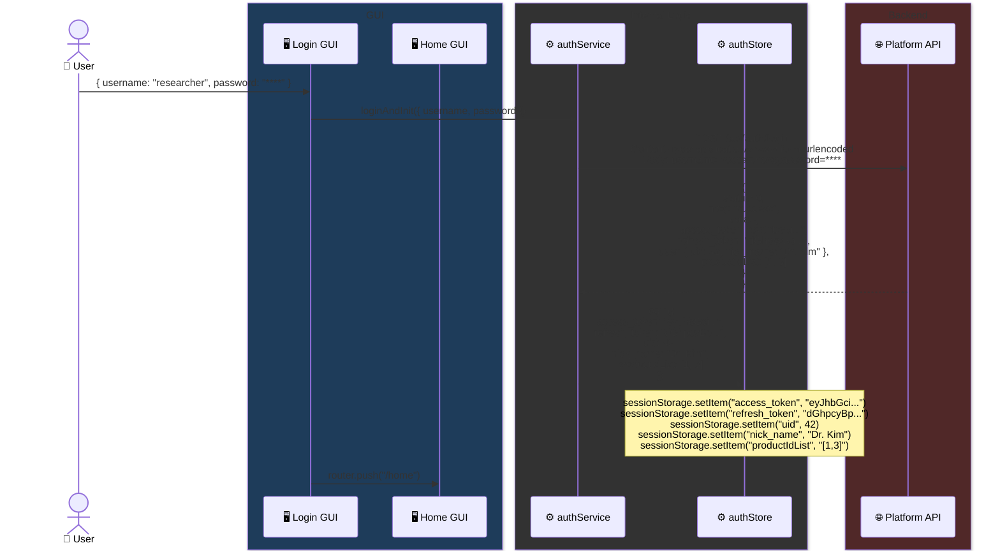

### 2.2 Home Bootstrap Sequence

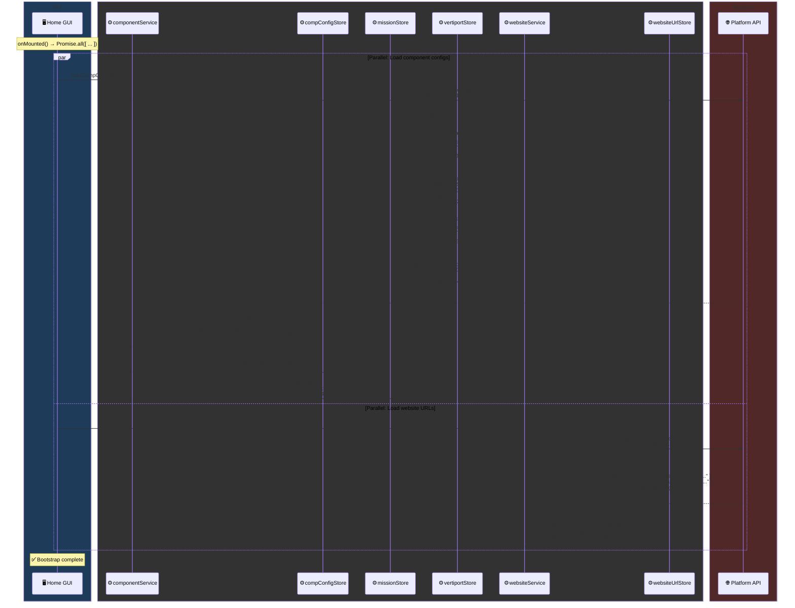

> [!IMPORTANT]
> **`productIdList: [1, 3]`** means this user has access to both ODT (`1`) and CADE (`3`). The sidebar dynamically shows/hides DTAM and CADE menu groups based on `productIdList.includes(COMPONENT_IDS.ODT)`.

---

## 3. Phase 2: Initial Configuration {#3-phase-2}

### 3.1 Configuration GUI Layout

```
🖥️ Configuration GUI
┌──────────────────────────────────────────────────┐
│           OPERATIONAL DIGITAL TWIN                │
│             INITIAL CONFIGURATION                 │
│  ┌──────────────────┬──────────────────────────┐  │
│  │ OPERATION ENV    │ VEHICLE CONFIGURATION     │  │
│  │ [Seoul ▾]        │ [Low] [Mid] [✅ High]     │  │
│  ├──────────────────┼──────────────────────────┤  │
│  │ MISSION SCENARIO │ AI PLUGINS               │  │
│  │ [✅ Simple]      │ [YOLO] [✅ R-YOLO]       │  │
│  │ [Customize]      │                           │  │
│  └──────────────────┴──────────────────────────┘  │
│  Status: Env: Seoul | Vehicle: High-Fidelity ...  │
│  [Save Configuration] [🟢 RUN ODT SYSTEM] [Load] │
└──────────────────────────────────────────────────┘
```

### 3.2 RUN ODT SYSTEM Sequence

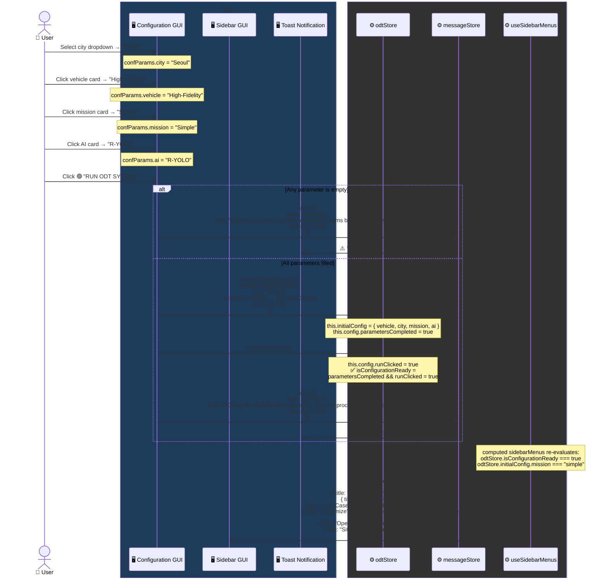

---

## 4. Phase 3: Mission Execution (Simple Mode) {#4-phase-3}

### 4.1 Use Case GUI Layout

```
🖥️ Use Case GUI
┌────────────────────────────────────────────────────────────────────┐
│  KADA ODT PROJECTS - MISSION PROFILE RUNNER    ● SYSTEM CONNECTED │
├──────────────┬──────────────────────┬──────────────────────────────┤
│ LINK SETTINGS│   TELEMETRY FEED     │   SYSTEM CONSOLE             │
│ IP:  10.0.0.5│   UAM1/altitude: 150 │   [UAM1] Taking off          │
│ PORT: 41451  │   UAM1/speed: 24.7   │   [UAM1] Ascending to 150m   │
│ Vehicles:    │   UAM1/battery: 87   │   [UAM1] Waypoint 1 reached  │
│   UAM1       │   UAM1/lat: 37.54    │   [UAM1] Cruising at 150m    │
│              │   UAM1/lon: 127.00   │                              │
│ [DISCONNECT] │   UAM1/heading: 45.2 │                              │
│              │                      │                              │
│ COMMANDS     │                      │                              │
│ [START (S0)] │   Auto-refresh 1s    │      Auto-refresh 1s         │
│ [RESUME]     │                      │                              │
│ [PAUSE]      │                      │                              │
│ [RESET]      │                      │                              │
├──────────────┴──────────────────────┴──────────────────────────────┤
│  2026-03-31 15:30:00                                               │
└────────────────────────────────────────────────────────────────────┘
```

### 4.2 CONNECT Sequence

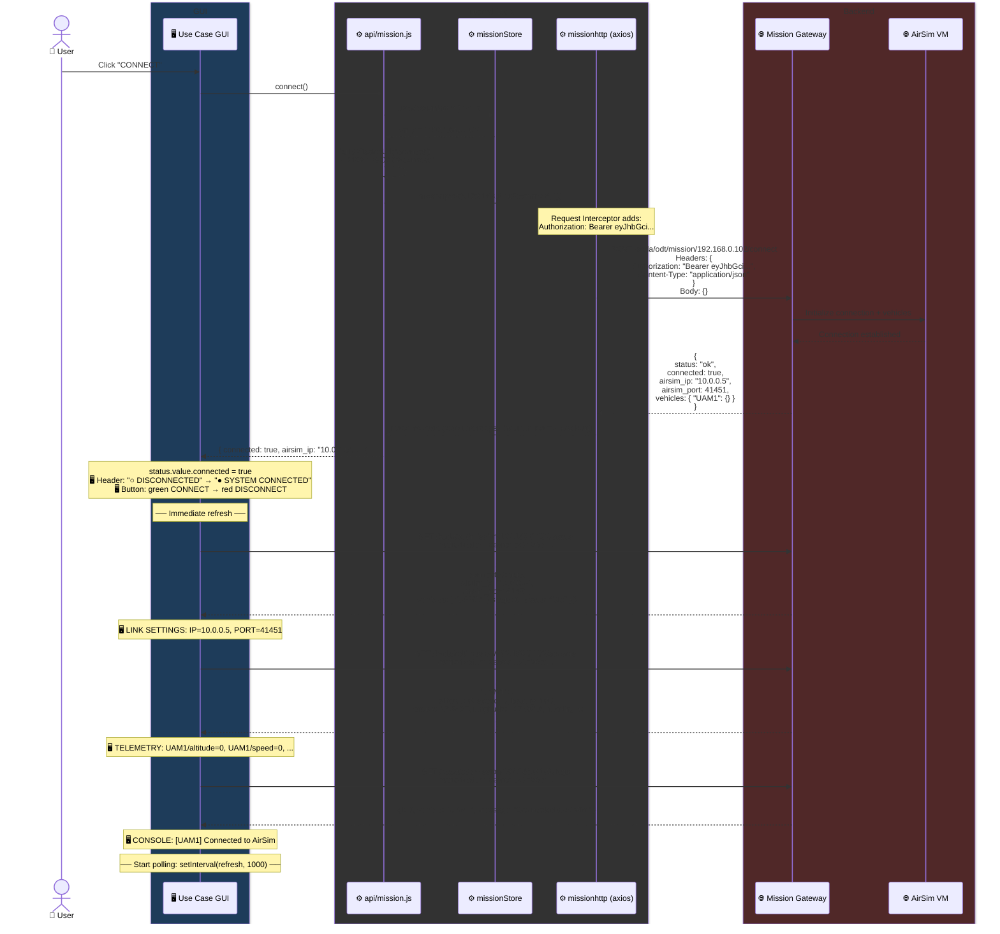

### 4.3 START Mission Sequence

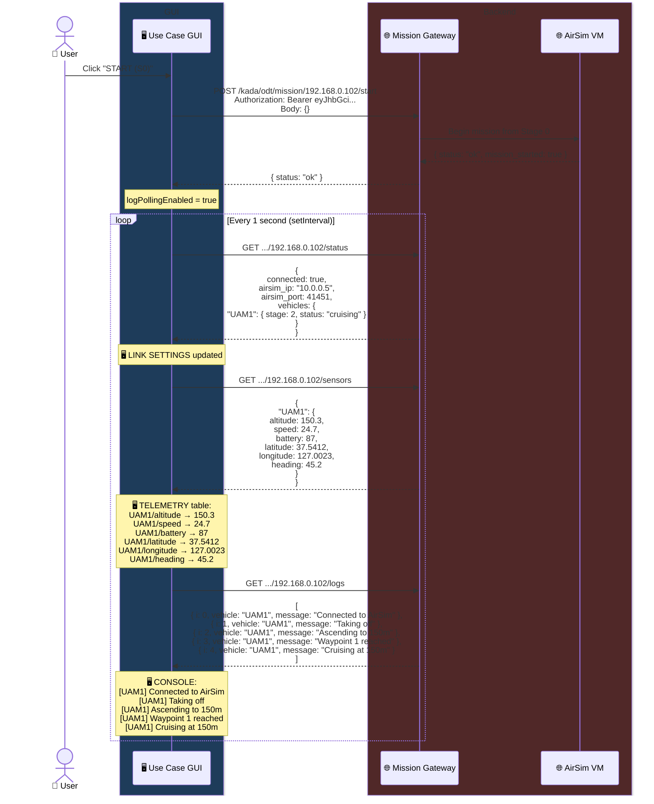

### 4.4 Control Commands (PAUSE / RESUME / RESET)

```mermaid
sequenceDiagram
    actor User as 👤 User

    box rgb(30, 60, 90) GUI
        participant MissionGUI as 🖥️ Use Case GUI
    end

    box rgb(80, 40, 40) Backend
        participant Gateway as 🌐 Mission Gateway
        participant AirSim as 🌐 AirSim
    end

    rect rgb(40, 60, 40)
        Note over User,AirSim: PAUSE
        User->>MissionGUI: Click "PAUSE / HOVER"
        MissionGUI->>Gateway: POST .../192.168.0.102/pause<br/>Authorization: Bearer eyJhbGci...<br/>Body: {}
        Gateway->>AirSim: Pause mission (hover in place)
        AirSim-->>Gateway: { status: "ok", paused: true }
        Gateway-->>MissionGUI: { status: "ok" }
        Note over MissionGUI: logPollingEnabled = true
    end

    rect rgb(40, 40, 60)
        Note over User,AirSim: RESUME
        User->>MissionGUI: Click "RESUME"
        MissionGUI->>Gateway: POST .../192.168.0.102/resume<br/>Authorization: Bearer eyJhbGci...<br/>Body: {}
        Gateway->>AirSim: Resume mission
        AirSim-->>Gateway: { status: "ok", resumed: true }
        Gateway-->>MissionGUI: { status: "ok" }
        Note over MissionGUI: logPollingEnabled = true
    end

    rect rgb(60, 40, 40)
        Note over User,AirSim: RESET
        User->>MissionGUI: Click "RESET UAMSIM"
        Note over MissionGUI: 🖥️ confirm("Reset AirSim?")
        
        alt User clicks Cancel
            Note over MissionGUI: No action
        else User clicks OK
            MissionGUI->>Gateway: POST .../192.168.0.102/reset<br/>Authorization: Bearer eyJhbGci...<br/>Body: {}
            Gateway->>AirSim: Reset world & mission state
            AirSim-->>Gateway: { status: "ok", reset: true }
            Gateway-->>MissionGUI: { status: "ok" }
            Note over MissionGUI: logPollingEnabled = false<br/>logs.value = []<br/>lastLogTs = 0<br/>🖥️ CONSOLE: cleared
        end
    end
```

### 4.5 DISCONNECT Sequence

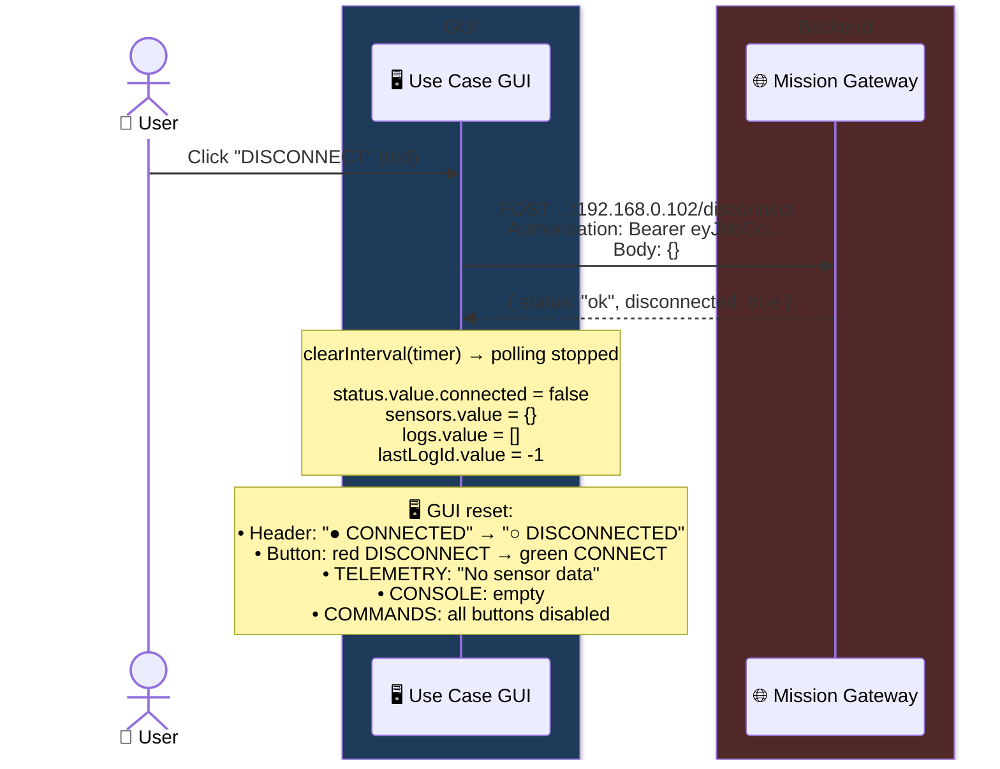

---

## 5. Phase 4: Operation Environment (Visualization) {#5-phase-4}

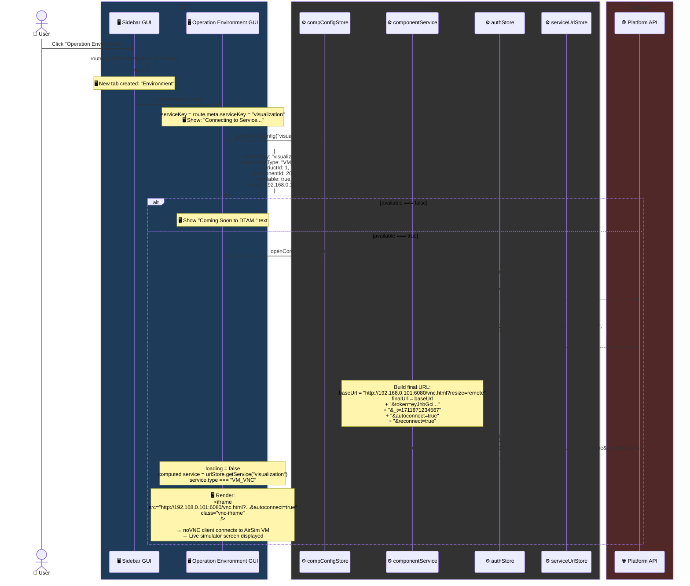

### 5.1 Service Type → Rendering

| `component_type` | GUI renders | Purpose |
|------------------|-----------|---------|
| `VM_VNC` | `<iframe src="http://{vmIp}:6080/vnc.html?...">` | noVNC → AirSim remote screen |
| `UE_WEB` | `<iframe src="{ueStreamUrl}">` | Unreal Engine Pixel Streaming |
| Other / null | `<p>Coming Soon to DTAM.</p>` | Placeholder |

### 5.2 Situation Monitoring (Same Code, Different serviceKey)

```
Route: /home/odt/visualization → serviceKey = "visualization" → compConfigStore["visualization"] → VM at 192.168.0.101
Route: /home/odt/situation     → serviceKey = "situation"      → compConfigStore["situation"]      → VM at 192.168.0.103
```

---

## 6. Phase 5: Vertiport Customize {#6-phase-5}

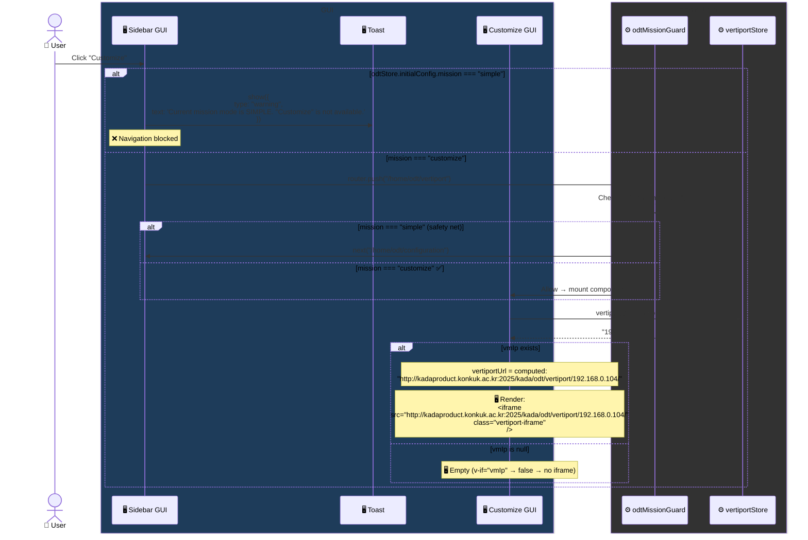

> [!IMPORTANT]
> Unlike Operation Environment, the Customize GUI does **NOT** call `openCompConn()`. It builds the iframe URL directly using a **hardcoded host** (`kadaproduct.konkuk.ac.kr:2025`) + `vertiportStore.vmIp`.

---

## 7. State Machine & Guard System {#7-state-machine}

### 7.1 State Transitions

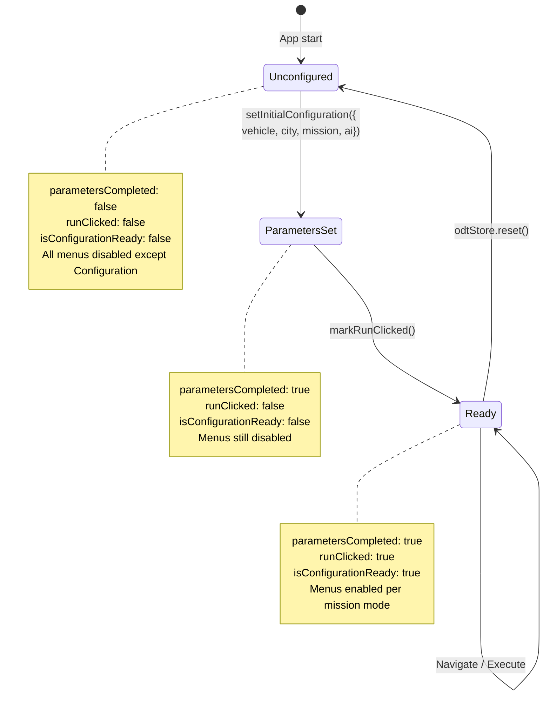

### 7.2 Triple Guard System

| Layer | Type | Trigger | Action |
|-------|------|---------|--------|
| **1** | 🖥️ Sidebar GUI | `!isConfigurationReady` or mission mode mismatch | Menu greyed out + warning toast on click |
| **2** | ⚙️ Route Guard | URL navigates to `/home/odt/vertiport` while `mission==="simple"` (or vice versa) | `next("/home/odt/configuration")` redirect |
| **3** | ⚙️ Component Watch | `odtStore.initialConfig.mission` changes while user is on incompatible page | `router.replace("/home/odt/configuration")` |

---

## 8. Real-time Data Polling {#8-polling}

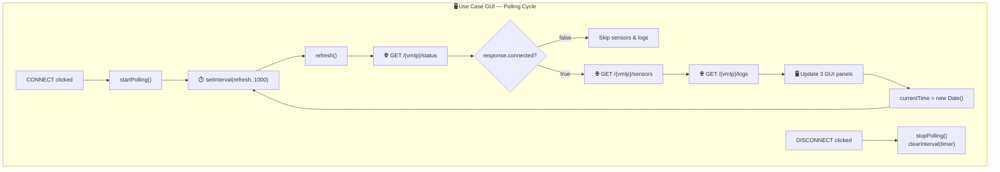

---

## 9. Runtime Architecture — Parallel Tabs {#9-parallel}

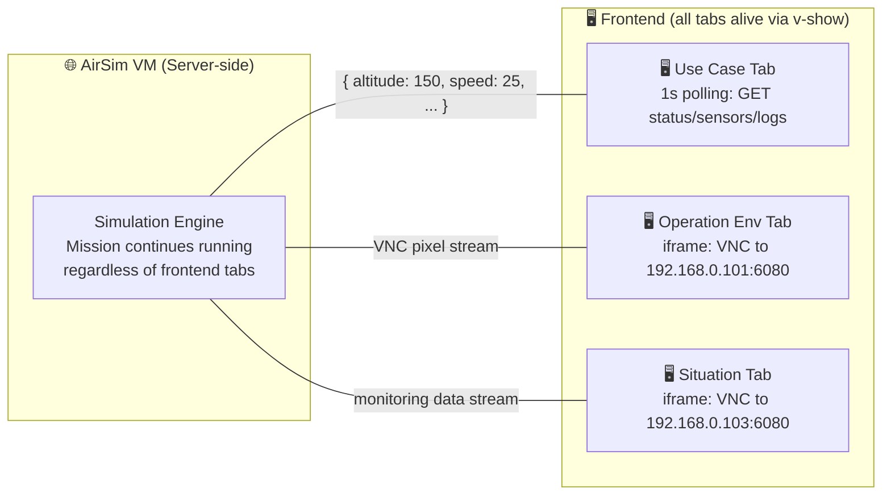

> [!NOTE]
> The mission **only stops** when the user clicks **PAUSE**, **RESET**, or **DISCONNECT**. Tab switching has zero effect on the running simulation.

---

## 10. GUI ↔ Source File Mapping

### 🖥️ GUI Screens

| GUI Screen | Source File | Role |
|------------|-----------|------|
| **Login GUI** | [LoginView.vue](file:///c:/Users/HJW/Documents/Dev/ODT/DTAMPlatform/kada-platform-web-frontend-main/src/views/LoginView.vue) | Login form |
| **Home GUI** | [HomeView.vue](file:///c:/Users/HJW/Documents/Dev/ODT/DTAMPlatform/kada-platform-web-frontend-main/src/views/HomeView.vue) | Layout shell |
| **Sidebar GUI** | [Sidebar.vue](file:///c:/Users/HJW/Documents/Dev/ODT/DTAMPlatform/kada-platform-web-frontend-main/src/layout/Sidebar.vue) | Navigation |
| **Configuration GUI** | [InitialConfiguration.vue](file:///c:/Users/HJW/Documents/Dev/ODT/DTAMPlatform/kada-platform-web-frontend-main/src/components/dtam/InitialConfiguration.vue) | 4 params + RUN |
| **Use Case GUI** | [MissionUpload.vue](file:///c:/Users/HJW/Documents/Dev/ODT/DTAMPlatform/kada-platform-web-frontend-main/src/components/dtam/MissionUpload.vue) | AirSim control |
| **Operation Env GUI** | [OperationDigital.vue](file:///c:/Users/HJW/Documents/Dev/ODT/DTAMPlatform/kada-platform-web-frontend-main/src/components/dtam/OperationDigital.vue) | VNC/UE iframe |
| **Situation GUI** | [OperationDigital.vue](file:///c:/Users/HJW/Documents/Dev/ODT/DTAMPlatform/kada-platform-web-frontend-main/src/components/dtam/OperationDigital.vue) | Monitoring iframe |
| **Customize GUI** | [VertiportWrapper.vue](file:///c:/Users/HJW/Documents/Dev/ODT/DTAMPlatform/kada-platform-web-frontend-main/src/components/dtam/VertiportWrapper.vue) | Vertiport iframe |
| **Toast** | [AppMessage.vue](file:///c:/Users/HJW/Documents/Dev/ODT/DTAMPlatform/kada-platform-web-frontend-main/src/components/common/AppMessage.vue) | Alert messages |
| **Tab Bar** | [TabView.vue](file:///c:/Users/HJW/Documents/Dev/ODT/DTAMPlatform/kada-platform-web-frontend-main/src/components/TabView.vue) | Tab management |

### ⚙️ Internal Logic

| Module | Source File | Role |
|--------|-----------|------|
| **ODT State** | [odtStore.js](file:///c:/Users/HJW/Documents/Dev/ODT/DTAMPlatform/kada-platform-web-frontend-main/src/stores/odtStore.js) | Ready flags |
| **Mission VM** | [missionStore.js](file:///c:/Users/HJW/Documents/Dev/ODT/DTAMPlatform/kada-platform-web-frontend-main/src/stores/missionStore.js) | vmIp state |
| **Mission API** | [mission.js](file:///c:/Users/HJW/Documents/Dev/ODT/DTAMPlatform/kada-platform-web-frontend-main/src/api/mission.js) | 9 API functions |
| **Service Connector** | [componentService.js](file:///c:/Users/HJW/Documents/Dev/ODT/DTAMPlatform/kada-platform-web-frontend-main/src/services/componentService.js) | iframe URL builder |
| **Route Guard** | [odtMissionGuard.js](file:///c:/Users/HJW/Documents/Dev/ODT/DTAMPlatform/kada-platform-web-frontend-main/src/router/guards/odtMissionGuard.js) | Route protection |
| **Menu Logic** | [useSidebarMenus.js](file:///c:/Users/HJW/Documents/Dev/ODT/DTAMPlatform/kada-platform-web-frontend-main/src/composables/useSidebarMenus.js) | Dynamic disabled |
| **Menu Data** | [menuConfig.js](file:///c:/Users/HJW/Documents/Dev/ODT/DTAMPlatform/kada-platform-web-frontend-main/src/data/menuConfig.js) | Menu tree |
