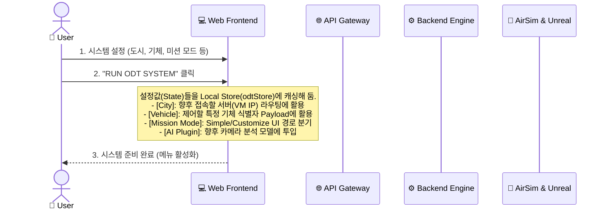
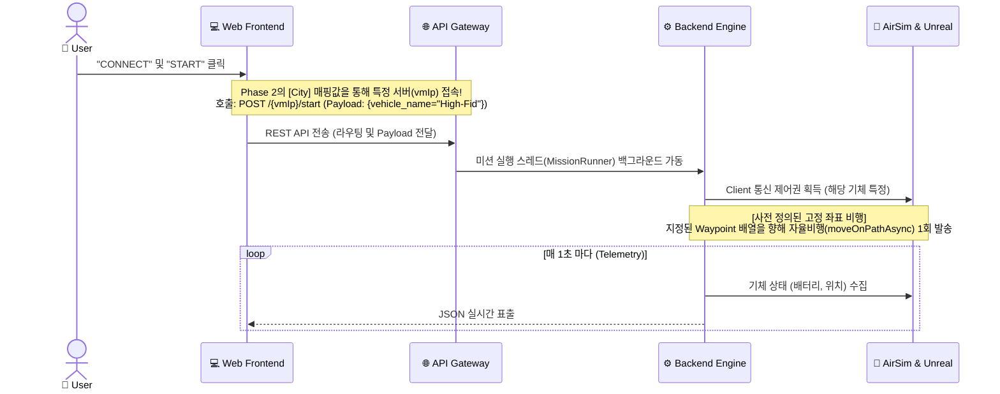
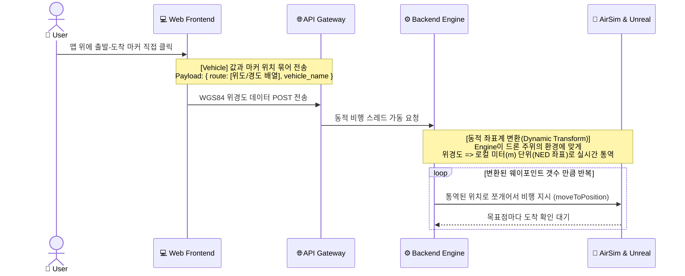
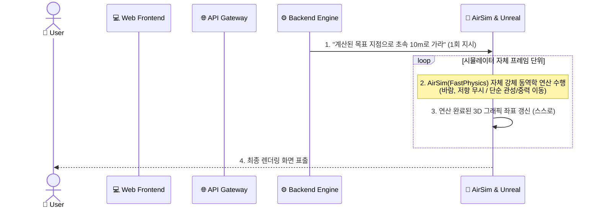
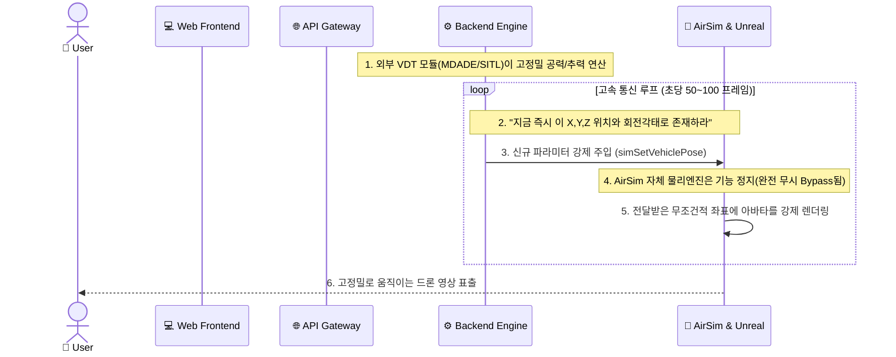
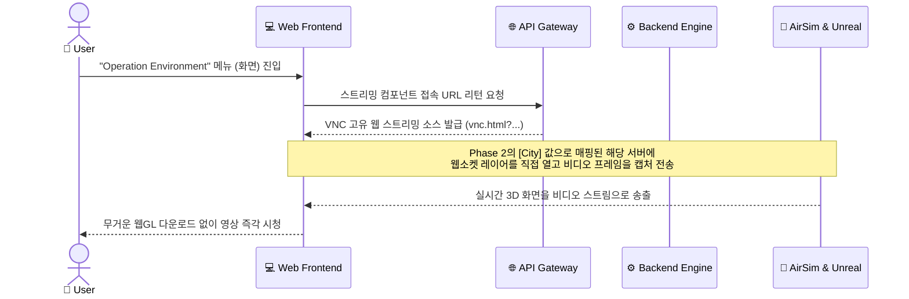

# ODT 시스템 시퀀스 & 동역학 아키텍처 (PPT 발표용 자료)

> **문서 활용 가이드**: 본 문서의 모든 다이어그램은 시스템이 다르게 보이지 않도록 **완벽히 동일한 5개의 구성요소(기둥)**를 사용해 통일성을 부여했습니다.
> 
> **[핵심 컴포넌트(기둥) 개념 설명]**
> *   💻 **Web Frontend**: 사용자가 누르는 Vue 화면 및 지도 Iframe.
> *   🌐 **API Gateway**: 웹 HTTP(POST/GET) 요청을 받아 검증하고 타겟 IP로 넘겨주는 통신 문지기 (프론트 통신용).
> *   ⚙️ **Backend Engine**: 실제 무거운 루프(While)나 자율비행 제어, VDT 수학 연산이 돌아가는 파이썬/C++ 핵심 워커(Worker).
> *   🚁 **AirSim (& Unreal)**: 3D 그래픽을 표출하고 기초 물리 판정을 내리는 시뮬레이터 렌더러.

---

## [Slide 1] Phase 2: Initial Configuration (초기 설정)
**발표 포인트**: 이 단계에서는 렌더링 부하나 엔진 통신이 전혀 없으며, 프론트엔드 환경에서 모든 Parameter를 세팅해 둡니다. 이는 이후의 "운명"을 결정하는 설계도가 됩니다.

---

## [Slide 2] Phase 3.1: Mission Execution (Simple Mode 흐름)
**발표 포인트**: 개발단계 및 관제 상황용 지정 경로 비행입니다. Phase 2에서 선택한 정보(VM IP, 기체명)가 Gateway와 Engine을 거쳐 시뮬레이터를 가동시킵니다.

---

## [Slide 3] Phase 3.2: Mission Execution (Customize Mode 흐름)
**발표 포인트**: 동적 라우팅 역학입니다. 사용자가 맵 프레임(Iframe)에서 찍은 경로 위치를 1차원 데이터가 아닌, 엔진이 연산 가능한 좌표로 변환합니다.

---

## [Slide 4] Phase 3.3: Mission Dynamics (Simple 연산과정)
**발표 포인트**: Phase 3.1 & 3.2에서 비행 지시가 들어갔을 때, 시뮬레이터 자체에 내장된 기초 물리 연산이 기동하는 시퀀스입니다. 

---

## [Slide 5] Phase 3.4: Mission Dynamics (High-Fidelity 연산과정)
**발표 포인트**: 정밀 해석입니다. AirSim 내부 물리 엔진을 완전 차단하고, 무거운 수학 연산을 전담하는 CADE/SITL(Backend Engine)이 통제권을 100% 장악합니다.

---

## [Slide 6] Phase 4: Operation Environment (시각화 연동 흐름)
**발표 포인트**: 비행 중인 언리얼 3D 렌더링 화면을 무거운 연산 없이, 마치 유튜브 영상 보듯 UI로 실시간 스트리밍해 주는 VNC 시퀀스입니다.

